8前端+3年全栈开发的技术路线沉淀。这一路如履薄冰，AI来了还能支持走到职场终点么。

<!--
 * @Author: humengchuan 531537052@qq.com
 * @Date: 2026-04-26 19:57:50
 * @LastEditors: humengchuan 531537052@qq.com
 * @LastEditTime: 2026-04-26 20:14:30
 * @FilePath: \work-tool\other\full-design.md
 * @Description:
-->

# 全栈技术架构设计

---

## 一、整体架构流程图

> 根据业务规模和团队技术栈，提供四种渐进式架构方案，从单体到微服务逐步演进。

---

### 架构一：前端 + Node.js 单体后端

> 适用场景：中小型项目、快速迭代、团队以前端/全栈为主

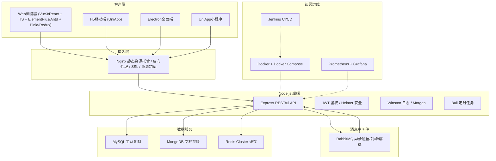

---

### 架构二：前端 + Go 单体后端

> 适用场景：高并发场景、CPU密集型业务、追求高性能低资源占用

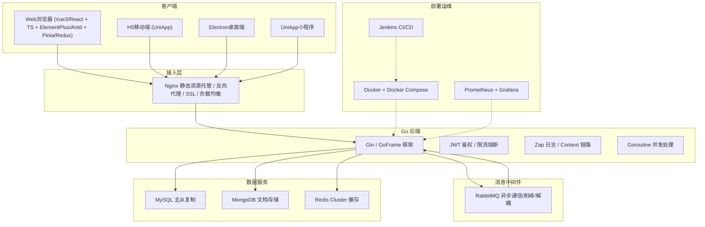

---

### 架构三：前端 + BFF(Node) + Go 微服务

> 适用场景：前后端协作复杂、多端适配、Go处理核心业务逻辑、Node做接口聚合与裁剪

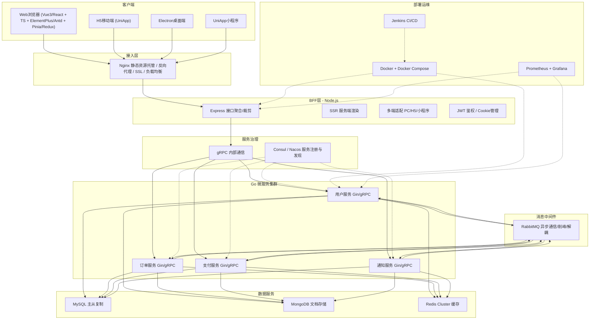

---

### 架构四：前端 + API 网关 + Go 微服务

> 适用场景：大型分布式系统、多团队协作、统一入口管控、去BFF层由网关承担路由与鉴权

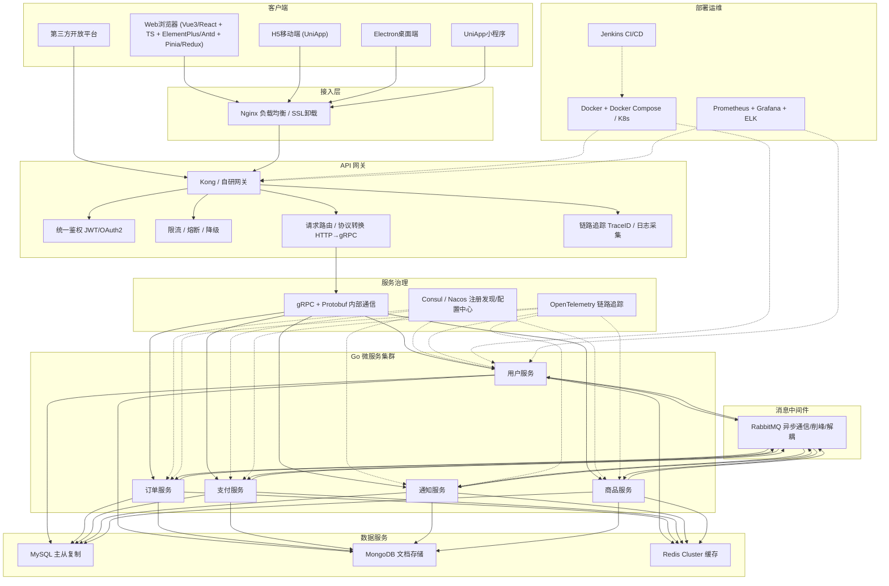

---

### 四种架构对比

| 维度     | 架构一 Node单体  | 架构二 Go单体 | 架构三 BFF+微服务 | 架构四 网关+微服务 |
| -------- | ---------------- | ------------- | ----------------- | ------------------ |
| 复杂度   | ⭐ 低            | ⭐⭐ 低       | ⭐⭐⭐ 中         | ⭐⭐⭐⭐ 高        |
| 并发性能 | 中               | 高            | 高                | 高                 |
| 开发效率 | 高               | 中            | 中                | 低                 |
| 多端适配 | 需自行处理       | 需自行处理    | BFF层聚合裁剪     | 网关路由分发       |
| 服务治理 | 无               | 无            | Consul/Nacos      | Consul/Nacos+网关  |
| 运维成本 | 低               | 低            | 中                | 高                 |
| 适用团队 | 1-3人全栈        | 2-5人后端     | 5-10人前后端      | 10+人多团队        |
| 典型场景 | 创业MVP/内部工具 | 高并发API服务 | 多端复杂业务      | 大型分布式平台     |

---

## 二、请求处理流程图

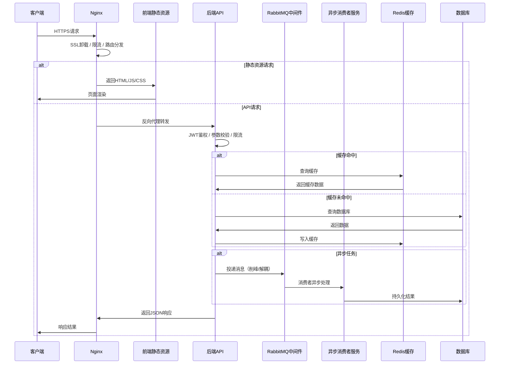

---

## 三、单服务器架构

### 3.1 前端

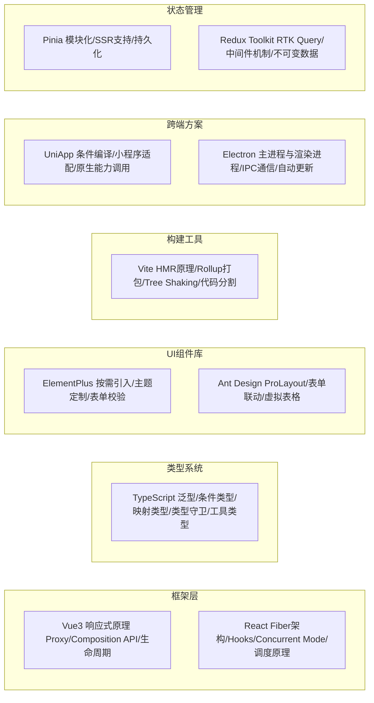

- **Vue3/React + TypeScript + ElementPlus/Antd + Vite**
  - Vue3（Proxy响应式、Composition API、watchEffect vs watch、v-model原理、keep-alive缓存机制、Teleport传送门、Suspense异步组件）
  - React（Fiber架构调度原理、Hooks闭包陷阱、useEffect清理机制、useMemo/useCallback性能优化、Concurrent Mode并发渲染、React.memo浅比较、虚拟DOM diff算法）
  - TypeScript（泛型约束extends、条件类型infer、映射类型Key Remapping、类型守卫is/in、工具类型Partial/Required/Pick/Omit、声明合并、模块增强）
  - ElementPlus/Ant Design（按需引入减少体积、主题定制CSS变量、表单校验规则、虚拟滚动长列表、国际化i18n）
  - Vite（基于ESM的HMR热更新原理、Rollup生产打包、Tree Shaking副作用标记、代码分割dynamic import、预构建esbuild、插件机制Plugin Hook）

- **跨端方案**
  - H5 UniApp（条件编译#ifdef、小程序API适配、原生能力调用uni API、分包加载、rpx适配方案）
  - Electron（主进程与渲染进程隔离、IPC通信ipcRenderer/ipcMain、BrowserWindow生命周期、自动更新electron-updater、进程沙箱安全contextIsolation、离线包方案）

- **状态管理**
  - Pinia（模块化Store、Composition API风格、SSR兼容、$onAction订阅、持久化插件pinia-plugin-persistedstate）
  - Redux Toolkit（createSlice简化Reducer、RTK Query数据缓存、中间件链式调用、不可变数据Immer、Selector性能优化reselect）

- **Nginx 作为反向代理**
  - 反向代理（proxy_pass配置、upstream负载均衡策略：轮询/权重/ip_hash/least_conn）
  - 静态资源服务（gzip压缩、expires缓存头、ETag协商缓存、try_files SPA路由回退）
  - SSL/TLS（Let's Encrypt证书自动续期、HTTP/2推送、HSTS安全头）
  - 安全防护（限流limit_req、防DDoS、XSS/CSRF头配置、CORS跨域配置）
  - 日志（access_log格式自定义、error_log级别、日志切割logrotate）

---

### 3.2 后端 - Node.js

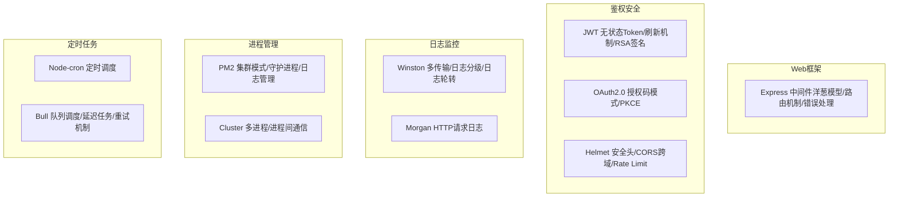

- **Node.js + Express（RESTful API）**
  - Node.js（事件循环Event Loop六阶段、libuv线程池、V8引擎内存管理、Stream流式处理背压机制、Cluster多进程模型、Worker Threads多线程、Buffer二进制处理、process.nextTick微任务优先级）
  - Express（中间件洋葱模型next()机制、Router模块化路由、错误处理中间件四参数、app.use挂载顺序、请求体解析body-parser、静态文件serve-static）
  - RESTful API设计（资源命名复数形式、HTTP语义化GET/POST/PUT/DELETE/PATCH、状态码规范200/201/400/401/403/404/500、分页参数page/limit、HATEOAS超媒体驱动、版本控制/api/v1）

- **鉴权与安全**
  - JWT（Header.Payload.Signature结构、无状态验证、Access Token + Refresh Token双Token机制、RSA256非对称签名、Token黑名单Redis存储、过期策略）
  - OAuth2.0（授权码模式Authorization Code、PKCE增强安全、隐式模式已废弃、客户端凭证模式、Token存储安全性）
  - 安全中间件（Helmet设置安全响应头、CORS跨域白名单配置、express-rate-limit限流防刷、express-validator参数校验、SQL注入防护参数化查询、XSS防护转义）

- **日志与监控**
  - Winston（多Transport输出：Console/File/HTTP、日志级别error/warn/info/debug、日志格式化timestamp/printf、日志文件轮转winston-daily-rotate-file、结构化日志JSON格式）
  - Morgan（combined/common/dev/tiny格式、自定义token、请求耗时记录、流式写入）

- **进程管理**
  - PM2（cluster模式利用多核、守护进程自动重启、log日志管理、ecosystem.config.js配置、gracefulReload零停机部署、监控pm2 monit）
  - Cluster（master/worker进程模型、进程间IPC通信、sticky session会话保持、worker退出自动fork重启、共享端口原理）

- **定时任务**
  - Node-cron（Cron表达式语法、时区处理、任务调度管理）
  - Bull（基于Redis的队列、延迟任务delay、重试机制retry、优先级priority、并发控制concurrency、事件监听completed/failed）

---

### 3.3 后端 - Go

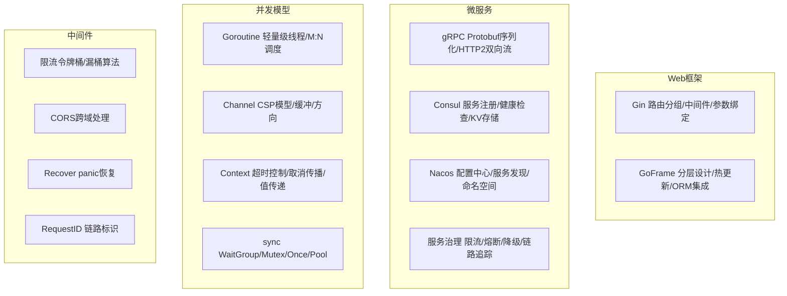

- **Gin 框架 / GoFrame**
  - Gin（Radix树路由高效匹配、中间件c.Next()/c.Abort()机制、ShouldBind参数绑定与校验、分组路由Group、JSON/XML响应渲染、HTML模板渲染、文件上传处理）
  - GoFrame（分层设计Controller/Service/Dao、gf cli代码生成、ORM链式操作、热更新air、配置管理gcfg、日志glog分级轮转、缓存gcache/gres资源管理）

- **微服务架构**
  - gRPC（Protobuf IDL定义、HTTP/2多路复用、四种通信模式：一元/服务端流/客户端流/双向流、拦截器Interceptor、健康检查协议、反射reflection）
  - 服务发现（Consul：服务注册+健康检查+KV存储+Raft一致性、Nacos：配置中心动态推送+服务发现+命名空间隔离+权重路由）
  - 服务治理（限流：令牌桶/漏桶/滑动窗口、熔断：Circuit Breaker三态Closed/Open/Half-Open、降级：fallback兜底策略、链路追踪：OpenTelemetry Jaeger Zipkin）

- **并发编程**
  - Goroutine（M:N调度模型、GMP调度器原理、G结构体栈扩张、抢占式调度sysmon、goroutine泄漏排查pprof）
  - Channel（CSP通信模型、无缓冲同步/有缓冲异步、方向约束单向通道、select多路复用、close关闭广播、nil channel阻塞特性）
  - Context（WithTimeout超时控制、WithCancel取消传播、WithValue值传递链、Deadline截止时间、父取消子级联取消）
  - sync包（WaitGroup并发等待、Mutex互斥锁正常/饥饿模式、Once单次执行、Pool对象复用减少GC、Map并发安全Map、Cond条件变量）

---

### 3.4 数据库

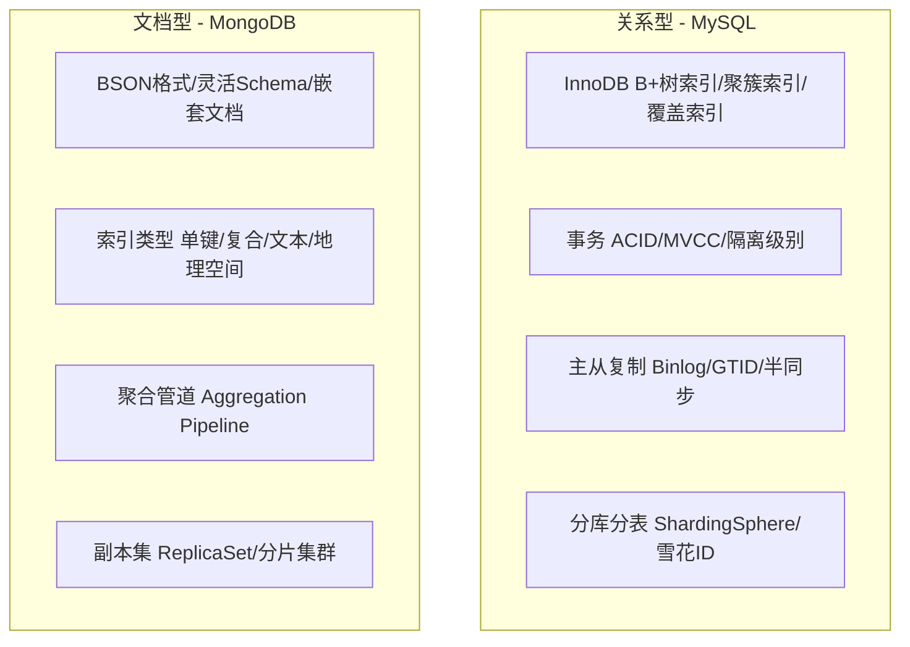

- **MySQL**（原子性 唯一性 幂等操作）
  - 存储引擎（InnoDB：B+树索引结构、聚簇索引与二级索引、行级锁、MVCC多版本并发控制undo log版本链、MyISAM：表级锁、全文索引）
  - 索引优化（最左前缀匹配、覆盖索引避免回表、索引下推ICP、联合索引选择性与顺序、EXPLAIN执行计划分析type/key/Extra、慢查询日志slow_query_log）
  - 事务与锁（ACID特性、隔离级别RU/RC/RR/Serializable、MVCC实现ReadView+UndoLog、Next-Key Lock防幻读、死锁检测与避免、分布式事务2PC/3PC/TCC/Saga）
  - 主从复制（Binlog三种格式STATEMENT/ROW/MIXED、GTID全局事务标识、异步/半同步/组复制、主从延迟Seconds_Behind_Master、读写分离中间件）
  - 分库分表（垂直拆分按业务、水平拆分按ID取模/范围、ShardingSphere中间件、分布式主键雪花算法Snowflake、跨库JOIN与聚合、分布式事务Seata AT模式）

- **MongoDB**
  - 数据模型（BSON二进制JSON、灵活Schema无固定结构、嵌套文档减少JOIN、引用文档DBRef、TTL索引自动过期、Capped固定集合）
  - 索引（单键/复合/多键数组/文本/地理空间2dsphere/哈希索引、ESR规则等值排序范围、explain执行计划）
  - 聚合管道（$match过滤/$group分组/$sort排序/$limit/$skip/$lookup关联/$unwind展开/$project投影/$addFields计算）
  - 高可用（副本集ReplicaSet主从选举Raft协议、读偏好ReadPreference、写关注WriteConcern、分片集群Shard+ConfigServer+Mongos、片键选择与jumbo chunk）

- **ORM**
  - Sequelize/TypeORM（模型定义与映射、关联关系1:1/1:N/N:M、事务管理、迁移Migration版本控制、懒加载与预加载eager/lazy、查询构建器QueryBuilder、钩子Hook生命周期）
  - GORM（模型约定与标签tag、AutoMigrate自动迁移、Preload预加载、Scope条件复用、事务Transaction/嵌套事务、Hook回调Before/After、软删除DeletedAt、复合主键）

---

### 3.5 缓存 - Redis

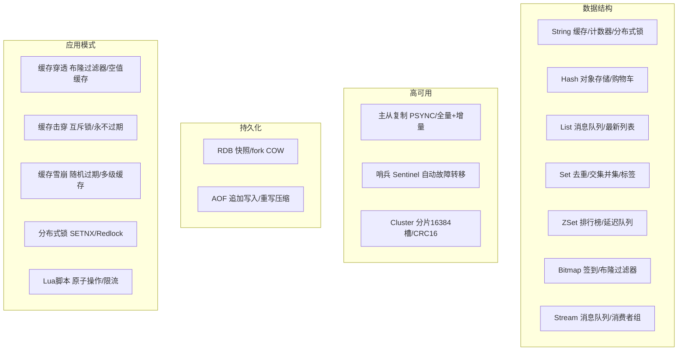

- **Redis Cluster**
  - 数据分片（16384个哈希槽、CRC16(key) % 16384、节点动态扩缩容、槽迁移ASK/MOVED重定向）
  - 高可用（主从复制+自动故障转移、Gossip协议节点通信、集群最少3主3从、客户端路由缓存）

- **Redis 核心数据结构**
  - String（SDS动态字符串、缓存/计数器INCR/分布式锁SETNX PX、位运算BITOP）
  - Hash（压缩列表ziplist→哈希表hashtable、对象存储HGETALL、购物车HMSET）
  - List（quicklist双向链表+压缩列表、消息队列LPUSH+BRPOP、最新列表LRANGE、阻塞操作BLPOP）
  - Set（intset整数集合→hashtable、去重SADD、交并差SINTER/SUNION/SDIFF、标签系统、随机抽奖SRANDMEMBER）
  - ZSet（跳表skiplist+哈希表、排行榜ZRANGEBYSCORE、延迟队列score=时间戳、范围查询ZRANGEBYLEX）
  - Bitmap（位运算、用户签到SETBIT、布隆过滤器、统计BITCOUNT）
  - Stream（5.0+消息队列、消费者组XGROUP、消息确认XACK、持久化消费进度、与Kafka对比）

- **持久化**
  - RDB（fork子进程COW写时复制、save/bgsave、触发条件save配置、文件紧凑恢复快、可能丢失最后一次快照）
  - AOF（追加写入fsync策略always/everysec/no、AOF重写BGREWRITEAOF压缩、混合持久化RDB+AOF、数据更安全但文件更大）

- **Lua脚本**
  - 原子执行（EVAL/EVALSHA、KEYS与ARGV参数、脚本缓存SHA1、限流滑动窗口实现、分布式锁续期看门狗）

- **缓存问题**
  - 缓存穿透（查询不存在的数据→布隆过滤器拦截/空值缓存TTL/接口参数校验）
  - 缓存击穿（热点Key过期→互斥锁SETNX/逻辑过期永不过期+异步更新）
  - 缓存雪崩（大量Key同时过期→随机过期时间/多级缓存/熔断降级/Redis集群高可用）

---

### 3.6 消息队列 - RabbitMQ

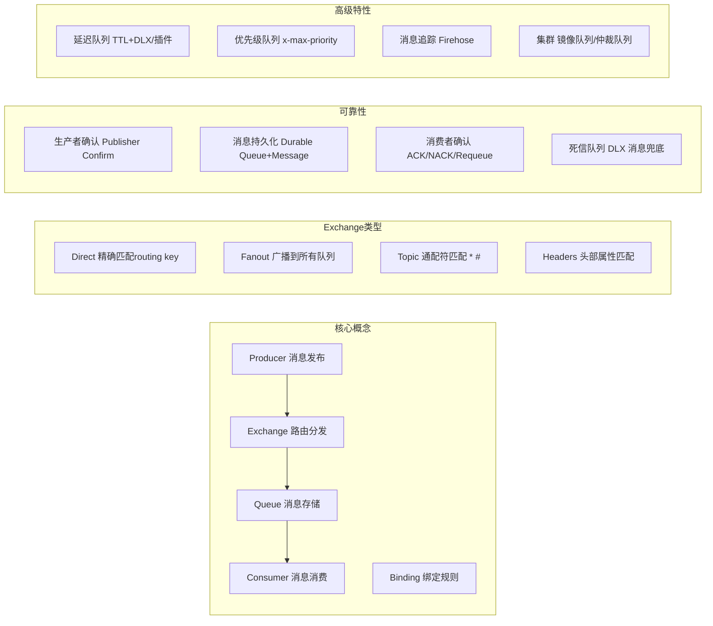

- **RabbitMQ**
  - 核心模型（Producer→Exchange→Queue→Consumer、Exchange四种类型：Direct精确匹配/Fanout广播/Topic通配符/Headers头部匹配、Binding绑定规则、Routing Key路由键、Virtual Host虚拟主机隔离）
  - 消息可靠性（生产者确认Confirm模式、消息持久化durable+persistent、消费者手动ACK/NACK/Requeue、死信队列DLX兜底处理、消息去重幂等性设计）
  - 高级特性（延迟队列TTL+DLX组合/rabbitmq_delayed_message_exchange插件、优先级队列x-max-priority、消息追踪Firehose插件、RPC回调队列reply_to/correlation_id）
  - 集群高可用（普通集群元数据同步、镜像队列ha-policy主从同步、仲裁队列Quorum Queue基于Raft、联邦Federation跨集群、Shovel消息搬运）
  - 面试要点（如何保证消息不丢失：生产者Confirm+持久化+消费者ACK、如何保证消息顺序性：单队列单消费者、如何处理消息积压：增加消费者+临时队列扩容、消息幂等性：唯一ID+去重表）

---

### 3.7 部署 - Docker + Docker Compose

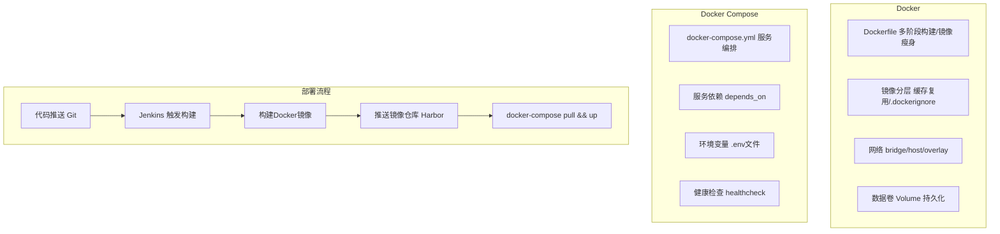

- **Docker**
  - Dockerfile（多阶段构建减小镜像体积、基础镜像alpine/slim选择、COPY vs ADD区别、RUN指令合并减少层数、.dockerignore排除无关文件、USER非root运行安全、HEALTHCHECK健康检查）
  - 镜像管理（镜像分层UnionFS、构建缓存利用、docker build --no-cache、多架构构建buildx、私有仓库Harbor/Registry、镜像安全扫描Trivy）
  - 网络（bridge默认桥接、host宿主机网络、overlay跨主机通信、none无网络、自定义网络DNS解析服务名、端口映射-p）
  - 数据卷（Volume持久化存储、Bind Mount绑定挂载、tmpfs内存存储、数据备份与恢复、命名卷vs匿名卷）

- **Docker Compose**
  - 编排配置（services服务定义、depends_on启动依赖、environment环境变量、volumes挂载、networks网络隔离、restart策略no/always/on-failure/unless-stopped）
  - 多环境（docker-compose.yml基础+docker-compose.override.yml开发覆盖+docker-compose.prod.yml生产覆盖、.env环境变量文件）
  - 常用命令（up -d后台启动、down停止删除、logs查看日志、ps服务状态、exec进入容器、build构建镜像）

---

### 3.8 CI/CD - Jenkins

```mermaid
graph LR
    A[Git Push/PR] --> B[Webhook触发Jenkins]
    B --> C[拉取代码]
    C --> D[安装依赖 npm install / go mod]
    D --> E[代码检查 ESLint / golangci-lint]
    E --> F[单元测试 Jest / go test]
    F --> G[构建打包 vite build / go build]
    G --> H[构建Docker镜像]
    H --> I[推送Harbor镜像仓库]
    I --> J[SSH部署到服务器]
    J --> K[docker-compose up]
    K --> L[健康检查验证]
    L --> M[通知 钉钉/邮件]
```

- **Jenkins**
  - Pipeline（Jenkinsfile声明式/脚本式、stages阶段定义、agent节点选择、post条件处理、parameters参数化构建、when条件执行、input人工审批）
  - 构建流程（Git SCM拉取代码、Webhook触发构建、npm install/go mod依赖安装、ESint/golangci-lint代码检查、Jest/go test单元测试+覆盖率、vite build/go build构建打包）
  - Docker集成（docker build构建镜像、镜像标签git commit hash、推送Harbor私有仓库、docker-compose pull && up -d部署）
  - 通知（邮件Email Extension、钉钉/飞书Webhook、构建状态Badge、构建日志归档）
  - 面试要点（蓝绿部署vs滚动部署vs金丝雀发布、回滚策略docker image tag回退、构建缓存加速、多分支流水线Multibranch Pipeline、凭证管理Credentials）

---

## 四、补充技术栈

### 4.1 API 网关

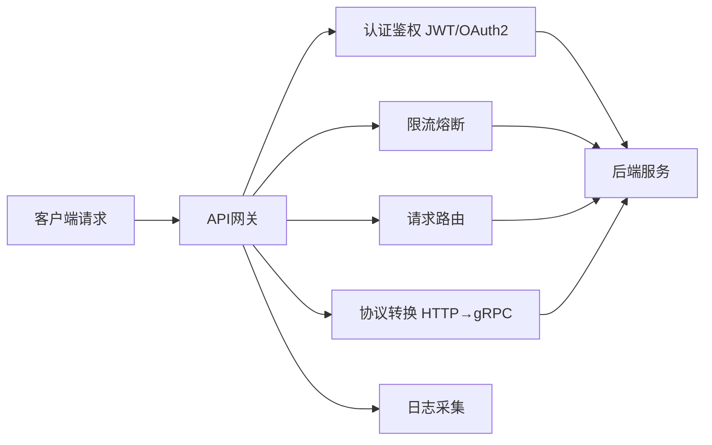

- **Kong / Nginx Plus / 自研网关**
  - 路由分发（基于Path/Header/Query路由、权重路由灰度发布、路径重写Rewrite）
  - 认证鉴权（JWT验证、OAuth2.0代理、API Key、IP白名单）
  - 限流熔断（令牌桶/漏桶限流、熔断器模式、降级响应）
  - 协议转换（HTTP↔gRPC转码、WebSocket代理、请求/响应转换）
  - 可观测性（请求日志、链路追踪TraceID注入、Prometheus指标暴露）

---

### 4.2 监控与可观测性

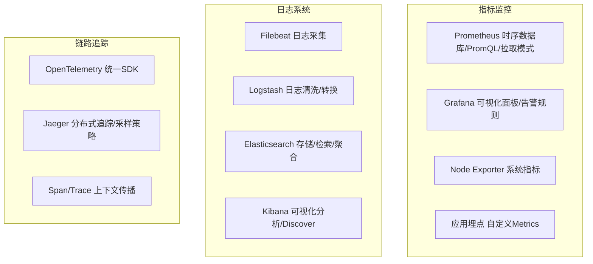

- **Prometheus + Grafana**
  - Prometheus（Pull拉取模式、PromQL查询语言、四种指标类型Counter/Gauge/Histogram/Summary、Service Discovery服务发现、AlertManager告警分级路由、数据采样间隔与保留策略、联邦集群Federation）
  - Grafana（Dashboard面板可视化、变量模板Variables、告警通知渠道、数据源多源混合、Annotations事件标注）

- **ELK Stack**
  - Elasticsearch（倒排索引原理、分片Shard与副本Replica、映射Mapping动态/静态、聚合Aggregation桶/指标、IK分词器中文支持、索引生命周期ILM冷热分离）
  - Logstash（Input/Filter/Output插件、Grok正则解析、Date时间处理、Mutate字段修改、条件判断if/else）
  - Filebeat（轻量级采集器、Prospector采集配置、Registry进度记录、Harvester逐行读取）

- **链路追踪**
  - OpenTelemetry（统一SDK覆盖Metrics/Traces/Logs、自动埋点与手动埋点、Context Propagation传播格式W3C TraceContext/B3、Sampler采样策略）
  - Jaeger（Span跨度、Trace全链路、采样策略概率/速率/自适应、依赖关系图、性能分析延迟热力图）

---

### 4.3 安全体系

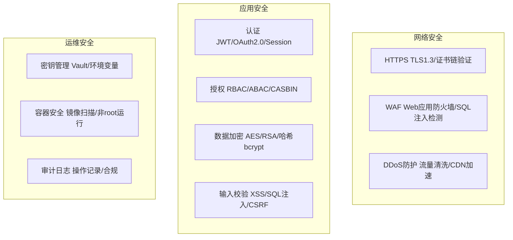

- **认证与授权**
  - JWT（无状态Token、Access+Refresh双Token、黑名单机制、Token续期策略、安全存储HttpOnly Cookie）
  - OAuth2.0（授权码模式最安全、PKCE防授权码拦截、Token刷新机制、Scope权限范围）
  - RBAC（角色-权限模型、用户-角色关联、权限粒度控制、Casbin策略引擎、权限缓存Redis）

- **数据安全**
  - 传输加密（HTTPS/TLS1.3、HSTS强制安全传输、证书固定Certificate Pinning）
  - 存储加密（密码哈希bcrypt/argon2、敏感字段AES加密、数据库透明加密TDE、密钥轮换策略）
  - 输入防护（XSS：转义+Content-Security-Policy、SQL注入：参数化查询/ORM、CSRF：SameSite Cookie+Token验证、文件上传：类型校验+大小限制+隔离存储）

---

### 4.4 性能优化

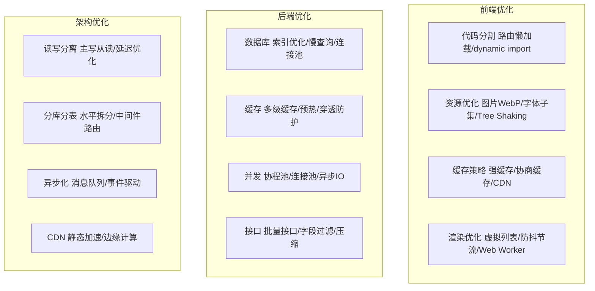

- **前端性能**
  - 加载性能（代码分割Code Splitting、路由懒加载、Tree Shaking消除死代码、图片懒加载loading=lazy、预加载preload/prefetch、Gzip/Brotli压缩、CDN加速静态资源）
  - 渲染性能（虚拟列表react-window/virtualized、防抖debounce/节流throttle、Web Worker计算密集任务、requestAnimationFrame动画优化、CSS containment、will-change GPU加速、避免强制同步布局）

- **后端性能**
  - 数据库（索引优化EXPLAIN分析、慢查询日志定位、连接池配置max/min/idle、批量操作减少RTT、读写分离降低主库压力）
  - 缓存（多级缓存L1进程缓存+L2 Redis+L3 DB、缓存预热启动加载、热点Key本地缓存、缓存一致性延迟双删/Canal监听Binlog）
  - 并发（Go协程池ants、数据库连接池、HTTP连接池Keep-Alive、异步IO非阻塞、批量接口合并请求）

---

### 4.5 测试体系

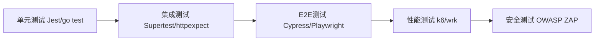

- **测试分层**
  - 单元测试（Jest前端/go test后端、Mock模拟依赖、覆盖率目标80%+、边界条件测试、快照测试Snapshot）
  - 集成测试（Supertest HTTP接口测试、数据库事务回滚清理、Testcontainers Docker容器化测试环境）
  - E2E测试（Cypress/Playwright浏览器自动化、Page Object模式、视觉回归测试、CI集成headless模式）
  - 性能测试（k6负载测试、wrk压测、基准测试Benchmark、火焰图pprof性能分析、慢接口P99延迟监控）

---

## 五、技术选型对比

| 维度     | Node.js                   | Go                    |
| -------- | ------------------------- | --------------------- |
| 并发模型 | 事件循环单线程            | Goroutine M:N调度     |
| 适用场景 | I/O密集/实时通信/快速迭代 | CPU密集/高并发/微服务 |
| 内存占用 | 较高(V8引擎)              | 极低(栈初始2KB)       |
| 启动速度 | 较慢                      | 极快(编译型)          |
| 开发效率 | 高(动态类型/生态丰富)     | 中(静态类型/编译检查) |
| 部署方式 | 需Node运行时              | 单二进制文件          |
| 错误处理 | try/catch运行时           | 多返回值编译时检查    |
| 热更新   | nodemon/热重载            | air/需要重启          |

| 维度     | MySQL             | MongoDB              |
| -------- | ----------------- | -------------------- |
| 数据模型 | 关系型/固定Schema | 文档型/灵活Schema    |
| 事务支持 | 完整ACID          | 4.0+支持多文档事务   |
| 扩展方式 | 垂直扩展/分库分表 | 水平分片原生支持     |
| 适用场景 | 强一致性/复杂关联 | 灵活结构/高写入/文档 |
| 索引     | B+树              | B树/特殊索引类型     |
| JOIN     | 支持              | $lookup性能有限      |
